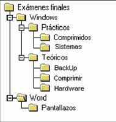

# Sistemas de Archivos

## Ejercicio 1: Concepto y noción de archivo real y virtual
1. Definiciones:
   - Archivo real: Es un conjunto de datos almacenados físicamente en un medio para guardar algo, como un disco duro o una memoria USB. Tiene una ubicación específica y ocupa espacio en el sistema.
   - Archivo virtual: Es una abstracción que no tiene una representación física, más bien que se genera en tiempo real a partir de otros recursos o procesos. Puede ser el resultado de estructuras dinámicas o de swapping.

2. Ejemplos:
   - Archivo real: Un documento de texto almacenado como `reporte.docx` en un directorio del disco duro.
   - Archivo virtual: Los archivos en `/proc` en sistemas Linux, que proporcionan información del sistema en tiempo real, como `/proc/cpuinfo`.

3. Caso práctico:
   - Utilidad de un archivo virtual: En sistemas Linux, `/proc/meminfo` permite consultar el estado actual de la memoria sin necesidad de crear un archivo real, ahorrando espacio y permitiendo datos siempre actualizados.

---

## Ejercicio 2: Componentes de un sistema de archivos
1. Componentes clave:
   - Metadatos: Información sobre los archivos, como tamaño, permisos y fecha de creación.
   - Tablas de asignación: Mecanismos para rastrear la ubicación de los datos en el disco.
   - Estructura jerárquica: Organización lógica de archivos y directorios.

2. Cuadro comparativo:

| Componente        | EXT4 (Linux)                                  | NTFS (Windows)                               |
|------------------------|--------------------------------------------------|-------------------------------------------------|
| Metadatos             | Almacena información en inodos                   | Usa la MFT (Master File Table)                  |
| Tabla de asignación   | Extents (bloques contiguos)                       | Clusters y registros en MFT                     |
| Registro de transacciones | Soporte de journaling para recuperación           | Journaling avanzado y soporte de transacciones  |

3. Ventajas y desventajas:
   - EXT4: Es más eficiente y rápido para sistemas Linux, pero limitado en compatibilidad con Windows.
   - NTFS: Da mayor seguridad y características avanzadas, pero es mucho más complejo.

---

## Ejercicio 3: Organización lógica y física de archivos
1. Árbol jerárquico:



2. Traducción lógica a física:
   - La ruta del archivo se traduce mediante tablas de asignación que indican la ubicación física de los bloques de datos.

3. Ejemplo práctico:
   - Un archivo llamado `foto.jpg` en `C:\Imágenes` se almacena físicamente en bloques del disco, cuyos índices se encuentran en la tabla de asignación.

---

## Ejercicio 4: Mecanismos de acceso a los archivos
1. Mecanismos de acceso:
   - Secuencial: Lectura desde el inicio al final.
   - Directo: Acceso a cualquier posición específica.
   - Indexado: Uso de índices para localizar datos rápidamente.

2. Pseudocódigos:
   - Secuencial:
     ```pseudo
     open archivo
     while not EOF:
         leer registro
         procesar registro
     close archivo
     ```
   - Directo:
     ```pseudo
     open archivo
     leer registro en posición n
     procesar registro
     close archivo
     ```
   - Indexado:
     ```pseudo
     cargar índice
     buscar registro en índice
     leer registro
     procesar registro
     ```

3. Ventajas:
   - Secuencial: Simplicidad, útil para procesar grandes volúmenes de datos.
   - Directo: Rápido para accesos puntuales.
   - Indexado: Balance entre rapidez y flexibilidad. Para mi, el mejor.

---

## Ejercicio 5: Modelo jerárquico y mecanismos de recuperación
1. Modelo jerárquico:
   - Raíz: `Sistema/`
     - `Usuarios/`
       - `Documentos/`
       - `Imágenes/`
     - `Sistema/`

2. Falla simulada:
   - Falla en `Usuarios/Documentos`. Recuperación mediante:
     - Uso de respaldos recientes.
     - Herramientas como `fsck` en Linux o `chkdsk` en Windows.

3. Técnicas de respaldo: Incrementales para respaldar solo cambios o completo ya que copia todo periódicamente.

---

# Protección y Seguridad

## Ejercicio 1: Concepto y objetivos de protección y seguridad
1. Definiciones:
   - Protección: Mecanismos para controlar el acceso a los recursos.
   - Seguridad: Salvaguardar la información contra amenazas externas.

2. Objetivos:
   - Confidencialidad: Restringir acceso no autorizado.
   - Integridad: Garantizar datos precisos y sin alteraciones.
   - Disponibilidad: Asegurar acceso a los datos cuando sea necesario.

   Es la triada conocida en ciberseguridad como CIA, no confundir con la agencia de inteligencia estadounidense. Que no estoy seguro si significa lo mismo en inglés, como sea.

3. Ejemplo práctico:
   - Autenticación de usuarios mediante contraseñas y permisos en sistemas Windows.

---

## Ejercicio 2: Clasificación aplicada a la seguridad
1. Clasificaciones:
   - Física: Protección del hardware.
   - Lógica: Control de acceso a software y datos.
   - Red: Prevención de accesos externos no autorizados.

2. Ejemplos:
   - Física: Uso de biometría.
   - Lógica: Firewalls y sistemas de permisos.
   - Red: VPNs y cifrado de tráfico.

---

## Ejercicio 3: Funciones del sistema de protección
1. Funciones principales:
   - Autenticación: Verificar identidad.
   - Autorización: Determinar acceso permitido.

2. Caso práctico:
   - En un sistema multiusuario, solo el administrador puede modificar configuraciones.

---

## Ejercicio 4: Implantación de matrices de acceso
1. Diseño de matriz:
   - Usuarios: `Admin`, `Usuario1`, `Usuario2`.
   - Recursos: `Archivo1`, `Archivo2`, `Configuración`, `Logs`.

|          | Archivo1 | Archivo2 | Configuración | Logs       |
|----------|----------|----------|---------------|------------|
| Admin    | RW       | RW       | RW            | RW         |
| Usuario1 | R        | RW       | -             | R          |
| Usuario2 | -        | R        | -             | R          |

---

## Ejercicio 5: Protección basada en el lenguaje
1. Definición:
   - La protección basada en el lenguaje se refiere a los mecanismos integrados en los lenguajes de programación que garantizan la seguridad y robustez de las aplicaciones al prevenir errores comunes y vulnerabilidades de seguridad. Estos lenguajes incluyen características que refuerzan el aislamiento, la gestión segura de memoria y la protección contra accesos no autorizados, aprovechando reglas estrictas de tipado y validación durante la compilación y la ejecución.

2. Seguridad de memoria en Java y Rust.

- Java: asegura la memoria mediante la gestión automática del recolector de basura (“Garbage Collector”). Esto elimina la posibilidad de errores comunes como fugas de memoria o accesos a regiones de memoria liberadas. Además, Java implementa verificaciones de límites en los arreglos para prevenir desbordamientos que podrían causar vulnerabilidades.

- Ejemplo: Si un arreglo intenta acceder a un índice fuera de los límites de un arreglo, Java lanza una excepción (“ArrayIndexOutOfBoundsException”), previniendo el acceso no autorizado.

- Rust: garantiza la seguridad de memoria utilizando un sistema de propiedad (“ownership”) y verificaciones estáticas en tiempo de compilación. Este modelo asegura que no se produzcan condiciones de carrera, referencias nulas o accesos no autorizados a la memoria.

- Ejemplo: Rust no permite tener referencias mutables y no mutables al mismo tiempo en un área de memoria. Cualquier intento de violar esta regla resulta en un error de compilación.

3. Comparación con otros mecanismos en sistemas operativos:

La protección basada en el lenguaje, en cambio, se enfoca en prevenir vulnerabilidades desde el momento de la programación y compilación.

Ventajas del enfoque basado en el lenguaje:

- Detecta errores antes de la ejecución.

- Ofrece herramientas específicas integradas en el lenguaje para manejo seguro de datos.

- Reduce la dependencia de los mecanismos del sistema operativo.

Limitaciones:

- Requiere programadores familiarizados con las características del lenguaje.

- La seguridad depende de la correcta utilización de las herramientas ofrecidas por el lenguaje.

---

## Ejercicio 6: Validación y amenazas al sistema

1. Amenazas comunes a un sistema operativo:

- Malware: Software malicioso diseñado para dañar, robar información o tomar control de un sistema. Ejemplos incluyen virus, gusanos y ransomware.

- Ataques de fuerza bruta: Intentos repetitivos de adivinar contraseñas o claves criptográficas mediante prueba y error.

- Inyección de código: Ataque donde un atacante introduce código malicioso en una aplicación para que este sea ejecutado con permisos del sistema. Ejemplo: Inyección SQL.

2. Mecanismos de validación:

- Autenticación multifactor (MFA): Combina varios factores para verificar la identidad de un usuario, como algo que saben (contraseña), algo que tienen (token de seguridad) y algo que son (biometría).

- Control de integridad: Verifica que los archivos y recursos del sistema no hayan sido alterados.

3. Esquema de validación para un sistema operativo con múltiples usuarios:

- Autenticación: Implementar MFA obligatorio para el acceso inicial al sistema.

- Roles y permisos: Asignar permisos basados en roles para limitar el acceso de usuarios a funciones y archivos específicos.

- Registro de actividades: Podemos monitorear las actividades de los usuarios y registrar eventos clave.

- Cifrado de datos: Cifrar archivos en reposo y en tránsito para prevenir accesos no autorizados incluso si se compromete el sistema.
---
## Ejercicio 7: Cifrado
1. Definiciones:
   - Simétrico: Usa la misma clave para cifrar y descifrar.
   - Asimétrico: Usa claves públicas y privadas.

2. Ejemplo práctico:
   - Simétrico: Cifrar archivo con AES.
   - Asimétrico: Uso de claves RSA para intercambio seguro.

3. Simulación:

Archivo original: "Hola Mundo".

Clave simétrica: "1234".

Resultado: "d4e3…" (cifrado).

Descifrado con la misma clave revela "Hola Mundo" nuevamente.
