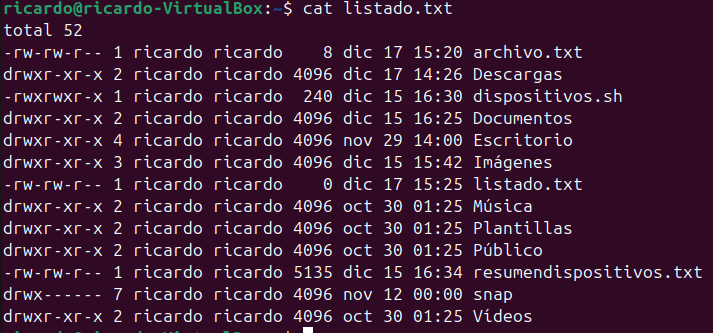

# Ejercicio 1: Montar y Desmontar Discos

Objetivo: Aprender a montar y desmontar un dispositivo externo.

Con el comando lsblk observamos la USB conectada llamada Kingstone:

Montamps la memoria USB en el directorio `/mnt/usb` con el comando: 

    sudo mount /dev/sdX1 /mnt/usb

Y observamos lo siguiente:

Esto porque desmontamos la USB del lugar donde estaba, creamos el punto donde se montaria y la montamos en ese lugar.

Y comprobamos que esta montada correctamente con `df -h`:

Copiamos un archivo desde tu directorio personal al dispositivo USB:

      cp archivo.txt /mnt/usb/

Vemos que ya aparece archivo.txt.

Y desmontamos la USB con `sudo umount /mnt/usb`

***
# Ejercicio 2: Redirección de Entrada y Salida.

Objetivo: Usar redirección para guardar la salida de comandos en archivos.

Primero listamos los archivos de tu directorio actual y guarda el resultado en un archivo `listado.txt`:

      ls -l > listado.txt

Y ponemos la fecha actual a listado.txt:

---
# Ejercicio 3: Copiar y Mover Archivos.
Objetivo: Practicar copiar y mover archivos y directorios.

Aqui creamos un archivo de texto llamado `archivo1.txt` luego copiamos este archivo a otro directorio, por ejemplo, `/tmp`. Después renombramos el archivo copiado a `archivo2.txt` en `/tmp` y finalmente movimos el archivo `archivo2.txt` de vuelta a tu directorio actual:

---
# Ejercicio 4: Comprimir y Descomprimir Archivos.
Objetivo: Aprender a trabajar con compresión de archivos.

Aqui vimos que se creó un directorio llamado `backup` y se comprimió.

Después borré el directorio original backup ya que está comprimido.

Finalmente, extraje el contenido del archivo comprimido.

---
# Ejercicio 5: Permisos y Propiedades de Archivos.
Objetivo: Aprender a modificar permisos y propietarios de archivos.

Primero, creé el archivo vacío llamado privado.txt usando el comando touch.

Usé el comando chmod para cambiar los permisos del archivo, de forma que solo el propietario pueda leer y escribir, y otros usuarios no tengan acceso al archivo:

El rw------- indica que solo el propietario tiene permisos de lectura y escritura.

Y como no tenemos otro usuario no puedo cambiarle los permisos, pero eso se hace con el comando `sudo chown usuario privado.txt
`.
---
# Ejercicio 6: Exploración de Dispositivos.
Objetivo: Identificar discos y particiones en el sistema.

Para empezar, usé lsblk para listar los discos y particiones:

Usé `du -sh` para ver el tamaño del contenido en un directorio de mi elección: 

Por último, usé el comando df para mostrar el uso del disco en tu sistema. La opción -h hace que los resultados sean legibles para los humanos (es decir, en GB o MB).

---
# Ejercicio 7: Crear y Formatear Particiones

Objetivo: Crear y formatear una nueva partición (Usar disco de práctica o máquina virtual).

Al ejecutar el comando `sudo fdisk -l`, vemos las particiones el dico y vemos que sdb no está en uso.

Hice una partición:

Formateé la nueva partición:

Monté la partición:

Y una prueba de escritura:

