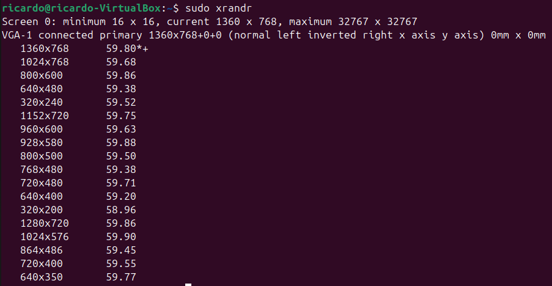

# Actividad 1: Listar dispositivos conectados

1. Comando: lsblk
Este comando muestra los dispositivos de bloque conectados al sistema, como discos duros, particiones y dispositivos extraíbles.
Salida observada:

Análisis: Se observan los discos conectados con sus particiones y tamaños.

2. Comando: lsusb
Lista todos los dispositivos conectados a los puertos USB del sistema.
Salida observada:

Análisis: Se detectan dispositivos como memorias USB, teclados o ratones.

3. Comando: lspci
Muestra todos los dispositivos conectados al bus PCI. Incluye tarjetas gráficas, controladores de red, entre otros.
Salida observada:

Análisis: Este comando permite identificar hardware interno como tarjetas de video o controladores.

4. Comando: dmesg | grep usb
Filtra los mensajes del kernel relacionados con dispositivos USB.
Salida observada:

Análisis: Este comando muestra detalles sobre los dispositivos USB detectados al conectarse al sistema, como controladores y estado.

## Preguntas y Respuestas
- ¿Qué tipos de dispositivos se muestran en la salida de lsblk?
Discos duros, particiones, y dispositivos de almacenamiento extraíbles. 
- ¿Cuál es la diferencia entre lsusb y lspci?
lsusb lista dispositivos USB externos conectados, mientras que lspci muestra hardware interno conectado al bus PCI. 
- ¿Qué información adicional proporciona dmesg | grep usb?
Muestra los mensajes del kernel relacionados con la detección y estado de los dispositivos USB. 

# Actividad 2: Verificar dispositivos de almacenamiento

1. Comando: fdisk -l
    Este comando lista todos los discos y particiones del sistema, mostrando información detallada como tamaño, tipo de partición y tabla de particiones.

    Salida observada:

    

    Análisis:
    Se identificaron discos principales y particiones adicionales, incluidas aquellas no montadas. Este comando es útil para configurar discos y particiones.

2. Comando: blkid
    Muestra los identificadores UUID y el tipo de sistema de archivos de cada dispositivo de almacenamiento.

    Salida observada:

    

    Análisis:
    Ayuda a distinguir dispositivos por sus UUID únicos, útil en la configuración de fstab para montar particiones automáticamente.

3. Comando: df -h
    Lista los dispositivos montados junto con su espacio total, utilizado, y disponible, en un formato legible para humanos.

    Salida observada:

    

    Análisis:
    Permite monitorear el uso del almacenamiento en particiones montadas, detectando rápidamente espacios insuficientes.

## Preguntas y Respuestas

- ¿Qué dispositivos de almacenamiento están conectados a su sistema? Discos duros internos, un dispositivo USB externo, y una partición SWAP.

- ¿Qué particiones están montadas actualmente? Particiones de sistema como /, /home y otras como /boot/efi.

- ¿Qué tipo de sistemas de archivos se usan en las particiones? Ext4 para particiones principales y FAT32 para /boot/efi.

# Actividad 3: Explorar dispositivos de entrada

1. Comando: cat /proc/bus/input/devices
    Lista todos los dispositivos de entrada detectados por el sistema, como teclados, ratones y dispositivos USB.

    Salida observada:

    
    

    Análisis:
    Cada dispositivo tiene un identificador único y una descripción básica que permite reconocer su función.

2. Comando: evtest
    Monitorea los eventos generados por dispositivos de entrada como teclados o ratones. Requiere permisos de superusuario.

    Salida observada:

    

    Análisis:
    Permite analizar las interacciones físicas con dispositivos, útil para depurar problemas de hardware.

## Preguntas y Respuestas

- ¿Qué eventos genera cada dispositivo al interactuar con ellos? El teclado genera códigos de tecla, el mouse eventos de movimiento y clics, y los controladores USB registran conexión/desconexión.

- ¿Cómo se identifican los dispositivos en /proc/bus/input/devices? Por atributos como Name, Phys, y Handlers, los cuales indican su ubicación física y controlador asignado.

# Actividad 4: Examinar dispositivos de salida

1. Comando: xrandr
    Lista las pantallas conectadas y sus resoluciones disponibles.

    Salida observada:

    

    Análisis:
    Se identificaron pantallas externas con diferentes resoluciones configurables.

2. Comando: aplay -l
    Lista las tarjetas de sonido detectadas y sus dispositivos asociados.

    Salida observada:

    

    Análisis:
    Ayuda a diagnosticar problemas con tarjetas de sonido y verificar dispositivos habilitados.

3. Comando: lsof /dev/snd/*
    Muestra los procesos que están utilizando dispositivos de sonido.

    Salida observada:

    

    Análisis:
    Identifica aplicaciones activas que interactúan con dispositivos de audio, útil para resolver conflictos.

## Preguntas y Respuestas

- ¿Qué salidas de video están disponibles en su sistema? HDMI-1 y eDP-1 (pantalla integrada y externa).

- ¿Qué dispositivos de sonido se detectaron? Una tarjeta de sonido interna y una salida de auriculares.

-¿Qué procesos están usando la tarjeta de sonido? Aplicaciones como el navegador web.

# Actividad 5: Crear un script de resumen

Creamos el archivo con: nano dispositivos.sh

Ponemos el contenido requerido:

Una vez guardado, le damos permisos al scrip para que sea ejecutable:

Ejecutamos:

Y tenemos el resultado usaso un comando como cat o less para revisar el contenido del archivo:

## Preguntas y Respuestas

Preguntas y Respuestas

- ¿Qué ventajas tiene usar un script para recopilar esta información? Ahorra tiempo, automatiza la recopilación y asegura uniformidad en los datos recopilados.

- ¿Qué cambios realizaría para personalizar el script? Agregaría marcas de tiempo, opciones de filtrado y formateo de salida para mayor claridad.

# Actividad 6: Reflexión y discusión
- ¿Qué comando encontró más útil y por qué?
el comando "cat /proc/bus/input/devices" porque lista todos los dispositivos de entrada detectados por el sistema, como teclados, ratones y dispositivos USB.

- ¿Qué tan importante es conocer los dispositivos conectados al sistema? Muy importante.

- ¿Cómo podrían estos conocimientos aplicarse en la administración de sistemas? De muchas maneras, por ejemplo, cuando no tienes una interfaz gráfica.

